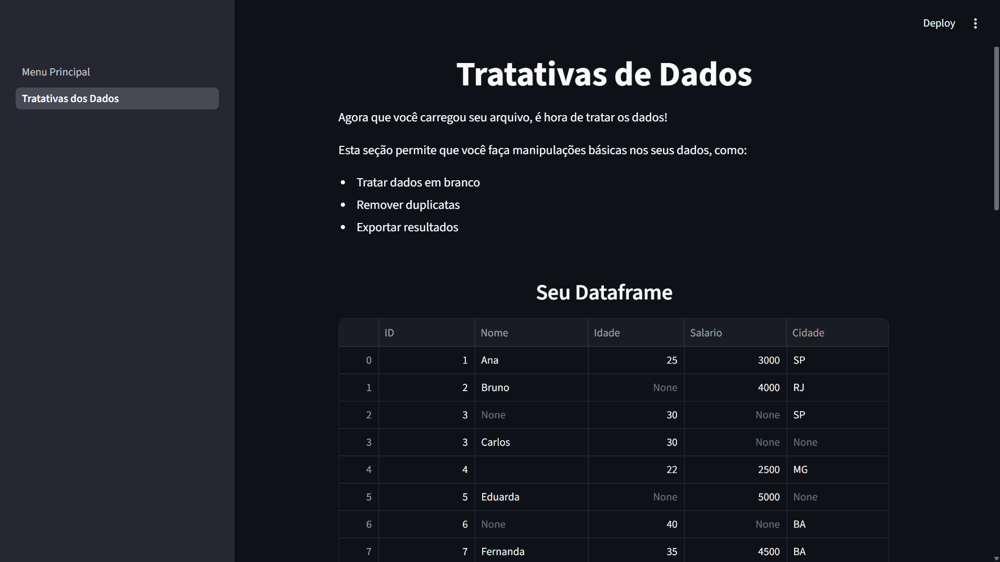

<h1 align="center">
Manipulador de Dados
</h1>

  

<h3 align="center">
Transforme seus dados em segundos ⚡
</h3>

Upload • Limpeza • Análise • Exportação

---

<h1 align="center">
O que é
</h1>

Uma aplicação interativa feita com **Python + Streamlit + Pandas** para manipular datasets de forma rápida e intuitiva.

Sem código. Sem complicação. Só resultado.

---

<h1 align="center">
Funcionalidades
</h1>

*  Upload de CSV e Excel
*  Visualização instantânea
*  Limpeza de dados:

  * remover duplicados
  * tratar nulos (média/moda)
  * remover linhas por índice
*  Resumo automático do dataset
*  Exportação em CSV e Excel
*  Reset para versão original

---

<h1 align="center">
Próximos Passos (não nessa ordem)
</h1>

*  Insights automáticos com IA
*  Análises estatísticas
*  Histórico de alterações (undo/redo)
*  Deploy online compartilhável

---

<h1 align="center">
Como rodar
</h1>

Para o pessoal um pouco mais leigo, mas interessado, é só colocar este código abaixo:

pip install -r requirements.txt

streamlit run app.py

---

<h1 align="center">
Autor
</h1>

**Murilo Moreno**

🔗 [https://www.linkedin.com/in/murilo-moreno-almeida-da-silva-ornelas-54885b29b/](https://www.linkedin.com/in/murilo-moreno-almeida-da-silva-ornelas-54885b29b/)

---

🔥 Projeto em evolução — feedbacks são bem-vindos!

